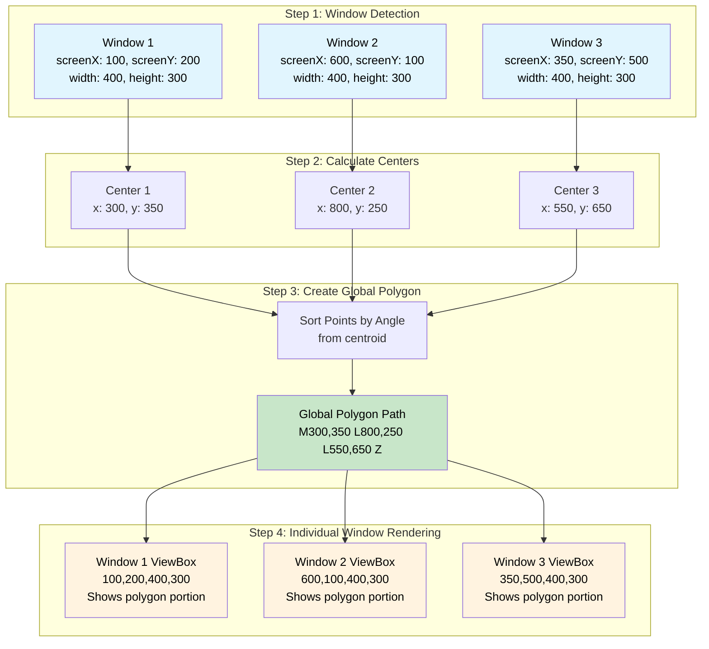
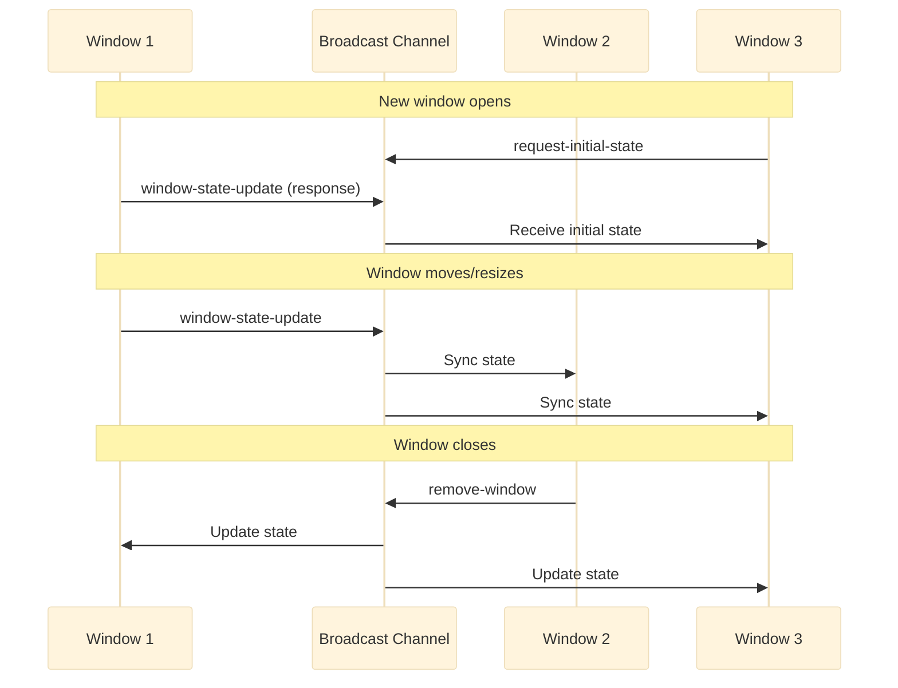

# Fun Windows - Multi-Window Polygon Demo

A React application that creates a shared visual space across multiple browser windows. Each window represents a vertex of a polygon, and the polygon is drawn across all windows, creating a synchronized multi-window experience.

🔗 **[Live Demo](https://serene-phoenix-f7789d.netlify.app/)**

[](public/rec.mp4)

## How It Works

The application creates a unique multi-window experience where:

1. **Open multiple browser windows** of the same application
2. **Each window becomes a vertex** of a dynamic polygon
3. **The polygon is drawn across all windows** in real-time
4. **Windows synchronize automatically** using the Broadcast Channel API
5. **Move or resize windows** to see the polygon adapt dynamically

### Core Concept

The application treats each browser window as a point in a shared coordinate system. When you have multiple windows open, it calculates the center point of each window and connects them to form a polygon. Each window displays its portion of this polygon, creating the illusion of a shape spanning across multiple windows.

## Technology Stack

- **React** - UI framework
- **TypeScript** - Type safety and better development experience
- **Vite** - Fast build tool and development server
- **Zustand** - Lightweight state management
- **Ramda** - Functional programming utilities
- **Vitest** - Testing framework
- **Broadcast Channel API** - Cross-window communication

## Architecture Overview

The application follows a modular architecture with a clear separation of concerns:

#### Core Components
- **WindowManager** - Main orchestrator component
- **WindowCanvas** - SVG rendering for polygon visualization
- **BackgroundLayer** - Visual background effects
- **DebugPanel** - Development and debugging information

#### State Management
- **windowStore** (Zustand) - Centralized state for all window data
- **Broadcast synchronization** - Real-time cross-window communication

#### Utilities
- **CoordinateSystem** - Handles coordinate transformations
- **GeometryUtils** - Polygon calculations and SVG path generation
- **LocalSync** - Cross-window state synchronization

## Coordinate System Logic

The application uses a sophisticated coordinate system to handle multiple windows:



#### Coordinate Transformation Process:

1. **Global Coordinates**: Each window reports its position on the screen (`screenX`, `screenY`)
2. **Window Center Calculation**: Calculate the center point of each window
3. **Polygon Formation**: Sort all center points to form a proper polygon
4. **Local Transformation**: Each window transforms the global polygon to its local coordinate system
5. **SVG Rendering**: Use ViewBox to show only the relevant portion in each window

## Broadcast Synchronization

The application uses the Broadcast Channel API for real-time synchronization between windows:



#### Synchronization Features:

- **Initial State Request**: New windows request current state from existing windows
- **Real-time Updates**: Window position/size changes broadcast immediately
- **Conflict Resolution**: Prevents circular updates during state synchronization
- **Automatic Cleanup**: Removes closed windows from shared state
- **Timeout Handling**: Graceful fallback if no other windows respond

## Key Features

#### Multi-Window Coordination
- Automatic detection of window position and size
- Real-time synchronization across all open windows
- Dynamic polygon recalculation when windows move or resize

#### Smart Geometry
- Intelligent point sorting for proper polygon formation
- Smooth polygon rendering with SVG paths
- Adaptive coordinate system for different screen configurations

#### Developer Experience
- Optional debug panel showing coordinate information
- Comprehensive TypeScript types
- Extensive test coverage
- Clean, modular architecture

## Getting Started

#### Prerequisites
- Node.js 16+ 
- Modern browser with Broadcast Channel API support

#### Installation

```bash
# Clone the repository
git clone https://github.com/Akurganow/fun-windows.git
cd fun-windows

# Install dependencies
npm install

# Start development server
npm run dev
```

#### Usage

1. Open the application in your browser
2. **Open additional windows** by duplicating the tab or opening new browser windows
3. **Position windows** around your screen to see the polygon form
4. **Move and resize** windows to see real-time updates
5. Enable debug panel in code to see coordinate information

## Available Scripts

- `npm run dev` - Start development server
- `npm run build` - Build for production
- `npm run preview` - Preview production build
- `npm test` - Run tests
- `npm run test:ui` - Run tests with UI
- `npm run type-check` - TypeScript type checking

## Browser Compatibility

- **Chrome/Edge**: Full support
- **Firefox**: Full support  
- **Safari**: Full support (iOS 15.4+)

The application requires the Broadcast Channel API, which is supported in all modern browsers.

## Contributing

1. Fork the repository
2. Create a feature branch
3. Make your changes
4. Add tests if applicable
5. Submit a pull request

## License

This project is open source and available under the MIT License.